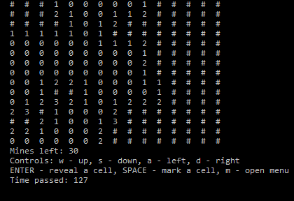

# Mineswooper
A simple terminal minesweeper implementation in C



## Building

Requirements:
- Windows 10
- GCC
- Make
- A terminal?

```
$ git clone	https://github.com/ricardascubukinas/mineswooper.git
$ cd mineswooper/src
$ make
$ ./game.exe
```

Then enjoy :)
